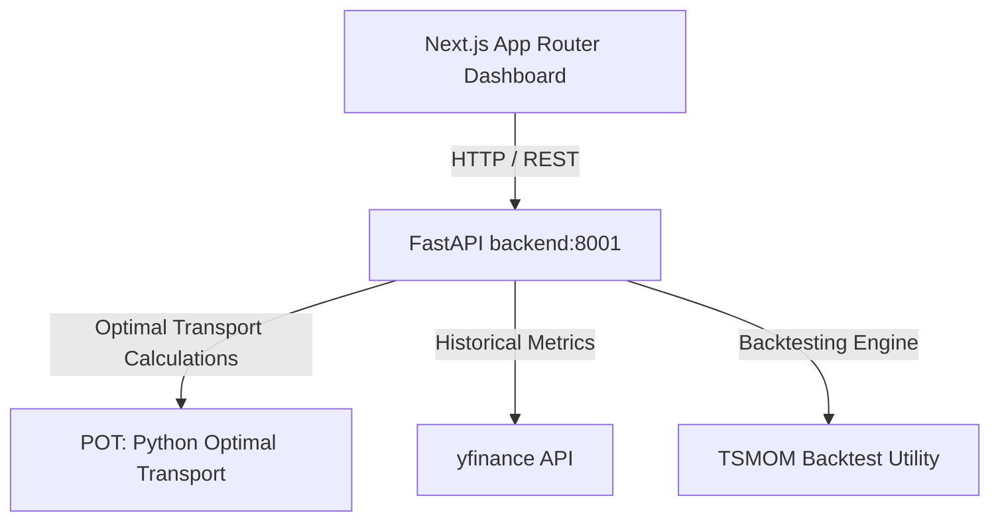

# Real-Time Market Regime Clustering & Backtesting Dashboard

An advanced, full-stack quantitative finance dashboard reproducing and extending the unsupervised market regime detection algorithm from the paper:

> **"Clustering Market Regimes Using the Wasserstein Distance"**
> B. Horvath, Z. Issa, and A. Muguruza (2021)
> [arXiv:2110.11848](https://arxiv.org/abs/2110.11848)

This project features a high-performance **FastAPI backend** performing Wasserstein K-Means clustering and Time Series Momentum (TSMOM) backtesting, paired with a gorgeous, dark-themed **Next.js frontend dashboard** to visualize active market regimes (Bull/Low-Vol vs. Bear/High-Vol) and strategy performance.

---

## 🏗️ Architecture Overview

The system aggregates live market data, clusters empirical probability distributions using optimal transport metrics, runs backtests, and serves visual telemetry:



* **Backend (`api.py`)**: Computes empirical probability distributions of overlapping log-return windows, runs the Wasserstein distance-based K-Means algorithm, re-orders clusters by variance, and computes TSMOM signal lines.
* **Frontend (`frontend/`)**: Renders cumulative returns comparisons, drawdowns, and live regime state metrics using React, Tailwind CSS, and Recharts.

---

## ⚡ Key Features

* **Wasserstein K-Means (WK-means)**: Clusters empirical distributions directly using the 1D Wasserstein distance rather than simple statistical moments, enabling superior capture of non-Gaussian tails and jump dynamics.
* **Moment K-Means (MK-means) Benchmark**: Computes standard moment-based clustering (variance/skewness/kurtosis) for comparative accuracy.
* **Synthetic Generative Models**: Regime-switching Geometric Brownian Motion (GBM) and Merton Jump Diffusion processes to test model classification boundaries.
* **TSMOM Strategy Backtester**: Evaluates Time Series Momentum performance across regimes, tracking cumulative returns against a benchmark Buy-and-Hold strategy.
* **Dynamic API Endpoints**: Serving live regime classifications (`/analyze`) and backtest statistics (`/backtest/tsmom`).

---

## 🏁 Getting Started

### 1. Backend Server Setup
1. Open your terminal and navigate to the root directory:
   ```bash
   cd real-time-market-regime-dashboard
   ```
2. Set up a virtual environment and install dependencies:
   ```bash
   python -m venv venv
   source venv/bin/activate  # On Windows: venv\Scripts\activate
   pip install -r requirements.txt
   ```
3. Run the FastAPI development server (defaults to port `8001`):
   ```bash
   python api.py
   ```
   * *Swagger Documentation is available at [http://localhost:8001/docs](http://localhost:8001/docs).*

### 2. Frontend Dashboard Setup
1. Open a new terminal window and navigate to the frontend directory:
   ```bash
   cd real-time-market-regime-dashboard/frontend
   ```
2. Install Node dependencies:
   ```bash
   npm install
   ```
3. Start the Next.js development server (defaults to port `3000`):
   ```bash
   npm run dev
   ```
4. Open [http://localhost:3000](http://localhost:3000) in your browser.

---

## 📈 Quantitative Research Scripts
You can run standalone experiments and view local plots:
```bash
# Run all experiments (Synthetic + Real Data on SPY)
python run_all.py

# Run only real data SPY analysis
python main_real_data.py

# Run only synthetic GBM & Merton experiments
python main_synthetic.py

# View generated figures in a grid layout
python view_figures.py
```

---

## 📊 Key Research Findings

On synthetic data with known ground truth regimes:
* **WK-means (Wasserstein)** outperforms benchmark clustering models on non-Gaussian datasets with heavy tails (such as the Merton Jump Diffusion), achieving **~99% classification accuracy** compared to **~75%** for moment-based clustering.
* The algorithm successfully captures historical crisis regimes including the **2008 Financial Crisis**, the **2015-2016 Chinese Market Crash**, and the **2020 COVID-19 Liquidity Shock**.

---

## 📋 API Spec

### 1. Analyze Market Regime
* **Endpoint**: `GET /analyze`
* **Query Parameters**: `ticker` (string, e.g. `SPY`), `window_size` (int, default `63`), `n_clusters` (int, default `2`).
* **Response**:
  ```json
  {
    "ticker": "SPY",
    "regime": 1,
    "label": "Bear/High Vol",
    "last_updated": "2026-08-21",
    "window_size": 63
  }
  ```

### 2. Run TSMOM Backtest
* **Endpoint**: `GET /backtest/tsmom`
* **Query Parameters**: `ticker` (string, e.g. `BTC-USD`), `lookback` (int, default `252`).
* **Response**:
  ```json
  {
    "ticker": "BTC-USD",
    "metrics": {
      "total_return_tsmom": 1.45,
      "total_return_buyhold": 0.88
    },
    "chart_data": [
      {
        "date": "2026-08-21",
        "price": 62500.0,
        "tsmom_cum": 2.45,
        "buyhold_cum": 1.88,
        "signal": 1
      }
    ]
  }
  ```
